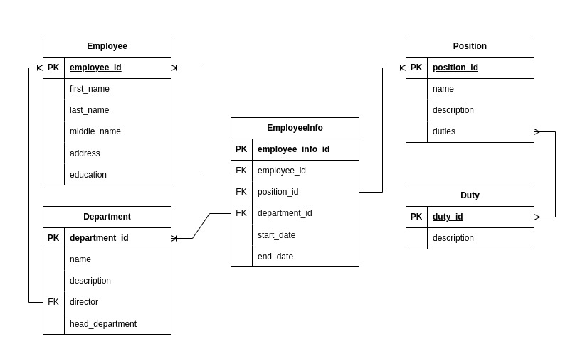

# Практикум по web-технологиям
#### Группа: 328
#### ФИО: Званцов Матвей Юрьевич
#### Вариант: 6, система информации о персонале компании

## Структура сайта
Сначала опишем структуру сайта.

### Страница входа
Пользователь попадает на страницу входа. Без авторизации на ней другие страницы будут перекидывать на неё.

### Главная страница
Информация о компании, картинки. Сверху видно путевое меню с кнопками (оно доступно на всех страницах, кроме входного), которые ссылаются на страницы с сотрудниками и подразделениями. Справа небольшое окно с логином пользователя. При наведении на кнопки появляется выпадающее меню. Можно попасть либо на общую страницу с сотрудниками (подразделениями), либо на страницу поиска сотрудника (или подразделения)

### Страница сотрудников
Пользователь получает список всех имеющихся сотрудников в алфавитном порядке. Видит их ФИО,  должность и подразделение.
Можно перейти к конкретному сотруднику на страницу, а можно перейти в поиск конкретного сотрудника.
При наличии особых прав, появляется третье меню сверху - найм/увольнение/редактирование сотрудников, ссылающееся на соответствующую страницу.

### Персональная страница сотрудника
Персональная страница сотрудника.
Доступна более полная информация: ФИО, образование, стаж в компании, должность, подразделение. Если права пользователя позволяют, то дополнительно появятся домашний адрес и возможность просмотра истории конкретного служащего (раскрывающийся список).

### Страница поиска сотрудника
В самом начале страницы есть плашка с параметрами поиска (ФИО, должность, подразделение, стаж работы в компании). Рядом кнопка поиск. Если параметры не указаны, то возвращаются все сотрудники. Если пользователя не существует, пользователь получает уведомление об этом. При наличии специальных прав, при успешном поиске отобразится больше информации о сотруднике.

### Страница Найма/Редактирования/Увольнения сотрудников
Эта страница доступна только пользователям с расширенными правами.
В самом начале страницы есть плашка, в которую необходимо ввести данные:
ФИО, должность, подразделение. На их основании находится конкретный сотрудник и над его данными можно проводить манипуляции:
изменение ФИО, должности, подразделения,
назначение директором подразделения, увольнение сотрудника.
Если такой сотрудник не найден, то будет выдано соответствующее сообещение и предложение создать его.
При создании указываются его данные: ФИО, образование, адрес, его должность и подразделение.

### Страница подразделений
Пользователь получает список всех имеющихся подразделений в алфавитном порядке. Видит их название и директора.
Можно перейти к конкретному подразделению на страницу, а можно перейти в поиск конкретного подразделения.
При наличии особых прав, появляется третье меню сверху - создание/редактирование/удаление подразделений, ссылающееся на соответствующую страницу.

### Персональная страница подразделения
Персональная страница подразделения.
Доступна более полная информация: Название, описание, руководитель, сотрудники, структурное деление . Под названием краткая информация о должностях и их количестве в подразделении.

### Страница поиска подразделения
В самом начале страницы есть плашка с параметрами поиска (название, руководитель). Рядом кнопка поиск. Если параметры не указаны, то возвращаются все подразделения. Если подразделения не существует, пользователь получает уведомление об этом.

### Страница Создания/Редактирования/Удаления подразделений
Эта страница доступна только пользователям с расширенными правами.
В самом начале страницы есть плашка, в которую необходимо ввести данные:
Название, ФИО руководителя. На их основании находится конкретное подразделение и над его данными можно проводить манипуляции:
изменение названия, директора, структуры.
При отсутствии такого подразделения, будет выдано сообщение и предложение создать таковое.
Создаётся по названию, директору и описанию.

## База данных для аутентификации

## База данных для работы с объектами компании

## Сценарии использования
Во всех сценариях не будем описывать пункт аутентификации на сайте, поскольку он необходим в любом случае.
Будем считать, что мы уже авторизованы.

### Получение списка поразделений
* По меню сверху переходим на подразделения

### Получение списка структур подразделений
* По меню сверху переходим на поиск подразделений
* В плашке вбиваем нужные данные подразделения (или оставляем пустым)
* Нажимаем поиск

### Получение списка служащих по различным фильтрам
* По меню сверху переходим на поиск сотрудников
* В плашке указываем необходимые параметры поиска
* Нажимаем поиск

### Получение истории для данного служащего
* Необходимо владение особыми правами
* По меню сверху переходим на поиск сотрудников
* В плашке указываем необходимые параметры поиска
* Нажимаем поиск

### Назначение служащего на новую должность в заданном подразделении
* Необходимо владение особыми правами
* Переходим по меню сверху на страницу сотрудников
* В дополнительном меню переходим на страницу найма/редактирования/удаления сотрудников
* В плашке заполняем необходимые данные
* Нажимаем поиск
* У найденного сотрудника будет множество параметров, изменяем подразделение и должность
* Нажимаем кнопку подтвердить

### Добавление нового служащего
* Необходимо владение особыми правами
* Переходим по меню сверху на страницу сотрудников
* В дополнительном меню переходим на страницу найма/редактирования/удаления сотрудников
* Нажимаем добавить сотрудника
* Заполняем данные
* Нажимаем кнопку подтвердить

### Удаление служащего, чтение и редактирование данных о нем
* Необходимо владение особыми правами
* Переходим по меню сверху на страницу сотрудников
* В дополнительном меню переходим на страницу найма/редактирования/удаления сотрудников
* В плашке заполняем необходимые данные о сотруднике
* Нажимаем поиск
* Читаем, изменяем. Если удалить, то нажимаем кнопку уволить.

### Добавление подразделения
* Необходимо владение особыми правами
* Переходим по меню сверху на страницу подразделений
* В дополнительном меню переходим на страницу создания/редактирования/удаления подразделений
* Нажимаем добавить подразделение
* Заполняем данные о нём
* Нажимаем кнопку подтвердить

### Удаление подразделения или должности, чтение и редактирование данных о них
* Необходимо владение особыми правами
* Переходим по меню сверху на страницу подразделений
* В дополнительном меню переходим на страницу создания/редактирования/удаления подразделений
* Заполняем данные в плашке
* Нажимаем поиск
* Читаем, изменяем. Если удалить, то нажимаем кнопку расформировать.
